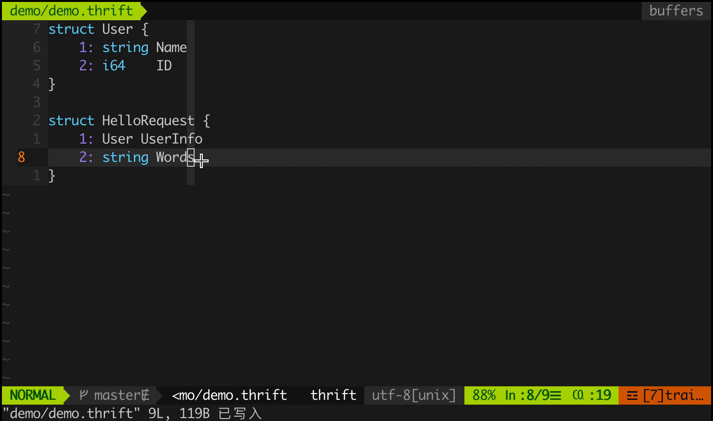
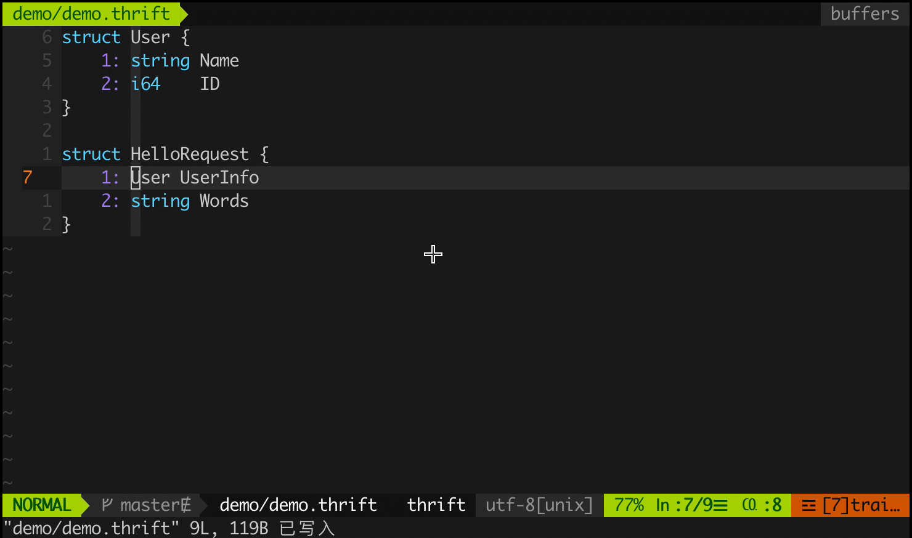
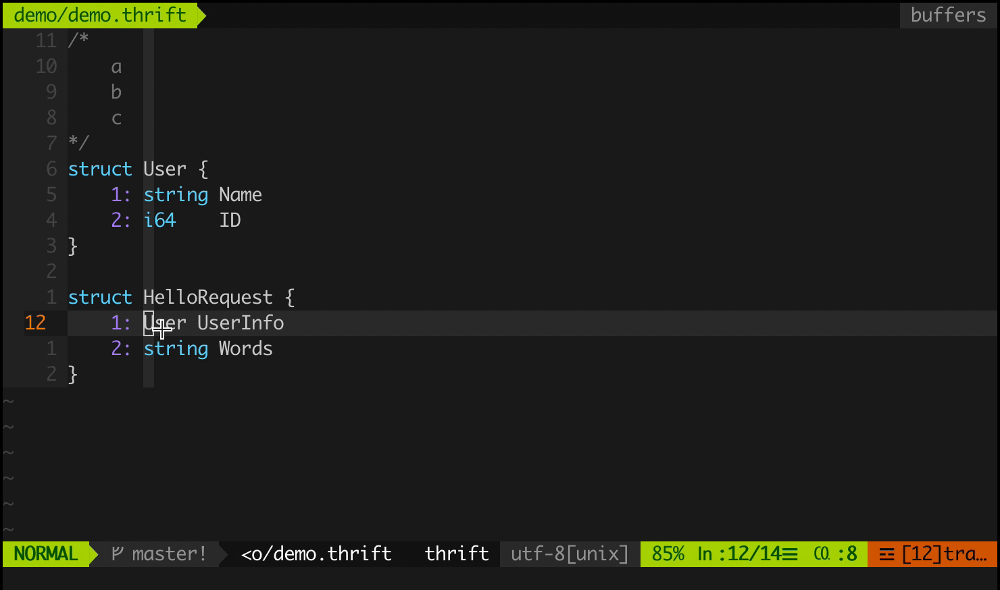

# coc-thrift-syntax-support

> fork from [thrift-syntax-support](https://github.com/MrKou47/thrift-syntax-support) and [commit](11cc3c9e585f07776a19f921dc72ecd256e9b1e5)

thrift syntax support for vim, You can use it to autocomplete, go to definition





## Install

`:CocInstall coc-thrift-syntax-support`

If you are using vim's plugin manager for coc-extensions, here's an example with vim-plug:

`Plug 'cposture/coc-thrift-syntax-support', {'do': 'yarn install --frozen-lockfile && yarn build'}`

## Usage

coc-thrift-syntax-support trigger completion request automatically without explicitly requesting it using a keyboard shortcut 

If you firstly use coc-extensions, here are some common configurations

```vim
" GoTo code navigation.
nmap <silent> gd <Plug>(coc-definition)

" Use K to show documentation in preview window.
nnoremap <silent> K :call <SID>show_documentation()<CR>

function! s:show_documentation()
  if (index(['vim','help'], &filetype) >= 0)
    execute 'h '.expand('<cword>')
  else
    call CocAction('doHover')
  endif
endfunction
```

## License

MIT

---

> This extension is built with [create-coc-extension](https://github.com/fannheyward/create-coc-extension)
